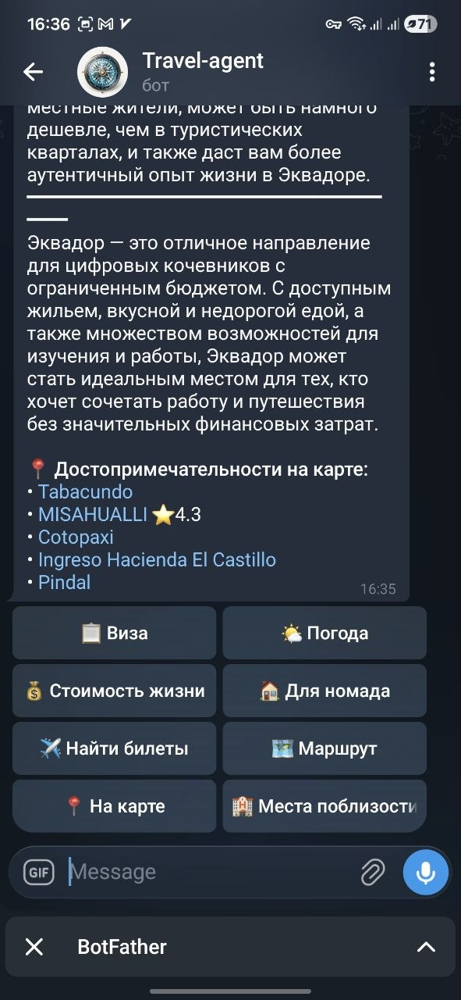
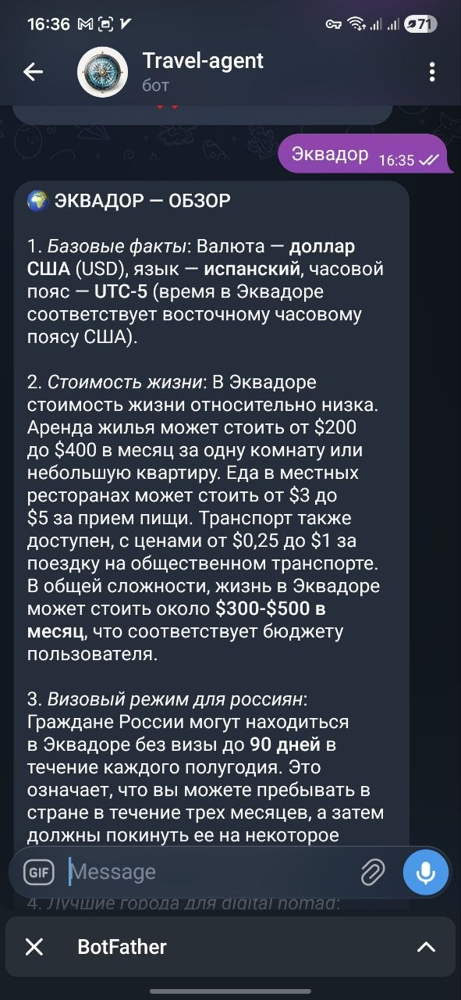
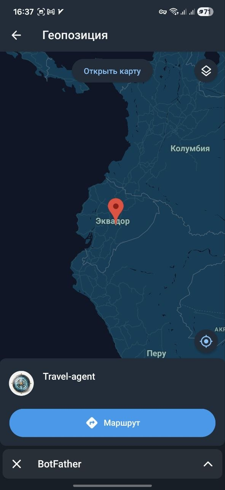
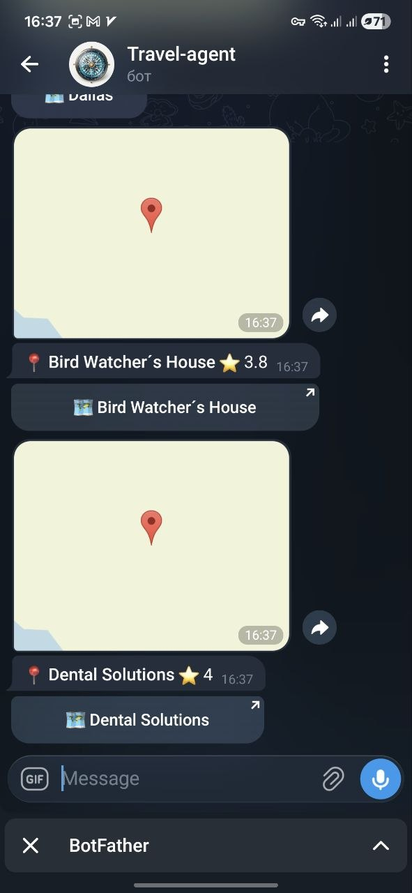

# Travel Agent — AI Telegram Bot for Budget Travelers

> **Live bot:** [@grip2peak_bot](https://t.me/grip2peak_bot) &nbsp;|&nbsp; **Stack:** Python · FastAPI · Gemini AI · Google Maps · PostgreSQL · Docker

A production-deployed multi-agent AI system that turns a Telegram chat into a complete travel planning assistant. Aimed at digital nomads and budget travelers — covering visa rules, cheap flights, cost of living, weather forecasts, interactive maps, and full round-the-world itineraries.

---

## Demo

| Explore a city | Browse & navigate |
|:-:|:-:|
|  |  |

| Interactive map | Nearby places |
|:-:|:-:|
|  |  |

---

## What it does

Send any message — the bot classifies intent with Gemini AI and fires specialized agents in parallel.

| Command | Result |
|---|---|
| `/explore Bali` | Neighborhoods, nomad vibe, cost overview, clickable tourist spots on Google Maps |
| `/visa Vietnam` | Entry rules for RU passport, visa-on-arrival vs e-visa, current fees |
| `/weather Chiang Mai` | 7-day forecast + best months to visit |
| `/flights Moscow Bangkok` | Cached cheapest prices + direct Aviasales booking link |
| `/budget Tbilisi` | Monthly breakdown: rent · food · coworking · transport |
| `/map Medellín` | Live location pin sent to chat |
| `/places Tokyo` | 3 nearest points of interest with location pins and Google Maps links |
| `/nomad` | Top cities ranked by cost matching your budget right now |
| `/worldtrip` | Full 6-month round-the-world plan with budget, visas, best seasons |

Every response ends with **contextual inline buttons** (e.g. after viewing visa info → book flights, check weather, see budget). Dialog history is preserved across the session so follow-up questions work naturally.

---

## Architecture

```
Telegram User
     │  HTTPS webhook (port 8443, Let's Encrypt SSL)
     ▼
 Nginx  ──▶  FastAPI (Uvicorn)
                  │
            Orchestrator
            (intent classification via Gemini + keyword fast-path)
                  │
     ┌────────────┼────────────┬──────────────┬────────────┐
     ▼            ▼            ▼              ▼            ▼
VisaAgent   WeatherAgent  FlightAgent   BudgetAgent   MapsAgent
     │            │            │              │            │
DuckDuckGo   WeatherAPI   Travelpayouts   50-city DB   Google Maps
(HTML scrape) + OWM fallback + deeplinks   + currency   geocode · places
     │
  Gemini 2.0 Flash ──▶ Russian-language synthesis
  (Groq Llama 3.3 fallback)

SharedContext: Redis 1h TTL  +  PostgreSQL (persistent across restarts)
Celery Beat:   price monitoring every 6h · cache cleanup every 1h
```

**Key design decisions:**

- **Parallel execution** — `asyncio.gather()` fires all relevant agents simultaneously; a "weather and budget for Bali" query runs both agents at once, cutting response time in half.
- **LLM for synthesis, APIs for data** — agents fetch structured numbers from real APIs, Gemini formats them into conversational Russian. No hallucinated prices or visa rules.
- **Dual-persistence context** — `SharedContext` writes to Redis immediately (fast reads) and PostgreSQL asynchronously (survives restarts). Session history feeds into every subsequent LLM prompt.
- **Graceful degradation** — every external call has a timeout + fallback: Gemini → Groq, WeatherAPI → OpenWeatherMap, Travelpayouts → Google Flights deeplink.
- **Zero-downtime deploys** — `docker compose up --no-deps app worker` restarts only app containers; PostgreSQL and Redis stay up. Alembic runs migrations after health check passes.

---

## Tech Stack

| Layer | Technology |
|---|---|
| Language | Python 3.11 · async/await throughout |
| Web Framework | FastAPI + Uvicorn (webhook mode) |
| Telegram | python-telegram-bot v21 |
| Primary LLM | Google Gemini 2.0 Flash |
| Fallback LLM | Groq Llama 3.3 70B (via httpx) |
| Maps | Google Maps API — geocoding · places · directions · Static Maps |
| Weather | WeatherAPI.com → OpenWeatherMap fallback |
| Flights | Travelpayouts Data API + Aviasales deeplinks |
| Search | DuckDuckGo Lite HTML scraping (no API key required) |
| Currency | ExchangeRate-API (Redis-cached, 1h TTL) |
| Task Queue | Celery + Redis |
| Database | PostgreSQL 16 + SQLAlchemy async + asyncpg |
| Migrations | Alembic |
| HTTP Client | httpx (async, 10s timeout) |
| Containers | Docker + Docker Compose |
| Reverse Proxy | Nginx + Let's Encrypt SSL |
| Hosting | Google Compute Engine — Ubuntu 24.04 |
| CI/CD | GitHub Actions → SSH deploy |

---

## Google Maps Integration

The bot sends **live location pins** to Telegram — users tap to open directly in Google Maps or any navigation app.

```
/map Kyoto           →  geocode → send_location() pin in chat
/places Lisbon       →  places_nearby() → 3 location pins + name links
/explore Bangkok     →  top 5 attractions as clickable maps.google.com links
/nomad               →  coworking spaces + cafes as clickable maps links
```

Implementation: `app/tools/maps.py` wraps the `googlemaps` SDK for geocoding and places search. `app/agents/maps_agent.py` formats results and decides whether to send a single pin or multiple. Inline keyboard buttons (`📍 На карте`, `🏨 Места поблизости`) trigger map lookups from any prior response.

---

## Project Structure

```
travel-agent/
├── app/
│   ├── main.py                 # FastAPI entrypoint + webhook registration
│   ├── config.py               # pydantic-settings from .env
│   ├── agents/
│   │   ├── orchestrator.py     # Intent classification + parallel dispatch
│   │   ├── visa_agent.py       # Web search + Gemini visa analysis
│   │   ├── weather_agent.py    # WeatherAPI + OWM + travel advice
│   │   ├── flight_agent.py     # Travelpayouts prices + Aviasales deeplinks
│   │   ├── budget_agent.py     # 50-city cost-of-living database
│   │   ├── maps_agent.py       # Google Maps geocoding + places + routes
│   │   └── worldtrip_agent.py  # Full itinerary planner via Gemini
│   ├── bot/
│   │   ├── handlers.py         # Commands · callbacks · dialog history
│   │   ├── keyboards.py        # InlineKeyboardMarkup builders
│   │   └── messages.py         # All user-facing text templates
│   ├── tools/                  # Raw API wrappers (maps, weather, flights, currency, search)
│   ├── models/                 # SQLAlchemy models (User, Trip, AgentContext, SearchCache)
│   └── memory/
│       └── context.py          # SharedContext: Redis + PostgreSQL dual persistence
├── workers/
│   ├── celery_app.py           # Celery config + Beat schedule
│   └── tasks.py                # Background tasks: price monitor, cache cleanup, notifications
├── alembic/                    # Database migrations
├── tests/                      # 44 tests — tools, agents, bot endpoints
├── deploy/
│   ├── nginx.conf              # Nginx reverse proxy config (port 8443 SSL)
│   ├── setup.sh                # First-time VM setup
│   ├── deploy.sh               # Zero-downtime deploy script
│   └── set_webhook.sh          # Register Telegram webhook
└── media/                      # Screenshots for docs (excluded from Docker image)
```

---

## Local Development

**Minimum required:** `TELEGRAM_BOT_TOKEN` + `GEMINI_API_KEY` (both free).

```bash
git clone https://github.com/nebula387/travel-agent.git
cd travel-agent
cp .env.example .env        # fill in at least TELEGRAM_BOT_TOKEN and GEMINI_API_KEY

docker compose up -d        # start all services
docker compose exec app alembic upgrade head
docker compose logs -f app  # watch logs
```

Run tests (no real external services needed — all mocked):

```bash
docker compose exec app pytest tests/ -v
# 44 passed in ~5 seconds
```

---

## Deployment

Runs on Google Compute Engine (Ubuntu 24.04). Nginx terminates SSL on port 8443 (Telegram-compatible), proxies to FastAPI on `127.0.0.1:8001`. Automatic deploy via GitHub Actions on every push to `main`.

```bash
# First-time VM setup
sudo bash deploy/setup.sh
sudo certbot --nginx -d bot.grip2peak.com --agree-tos -m you@email.com

# Every deploy (or automatic via CI/CD)
bash deploy/deploy.sh

# Register Telegram webhook
bash deploy/set_webhook.sh
```

Full guide: [DEPLOY.md](DEPLOY.md)

---

## Testing

```
tests/test_tools.py   — 15 tests  pure functions + httpx mocks (WeatherAPI, DuckDuckGo, Maps)
tests/test_agents.py  — 22 tests  intent classification, all 7 agents, orchestrator synthesis
tests/test_bot.py     —  6 tests  FastAPI webhook endpoint, health check, command routing
─────────────────────────────────────────────────────────────────────────────────────────
44 passed in ~5 seconds  (Redis and LLM mocked via AsyncMock; HTTP via pytest-httpx)
```

---

## Roadmap

- [ ] `/route` — multi-city itinerary with real transport connections
- [ ] Price alerts UI — Celery Beat already monitors; need subscribe/unsubscribe commands
- [ ] Accommodation search — Hostelworld / Booking.com scraping
- [ ] OpenSky live flight tracking — real-time plane positions on map
- [ ] Web dashboard — trip history, saved routes, budget tracker

---

## License

MIT — fork and adapt freely.
